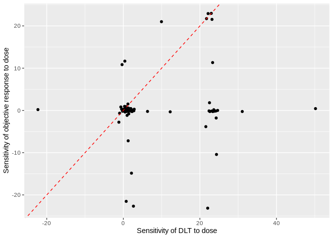
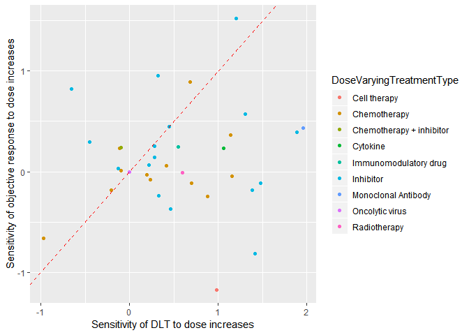
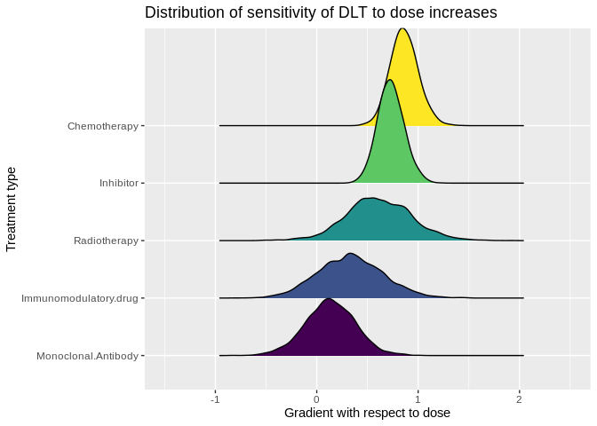
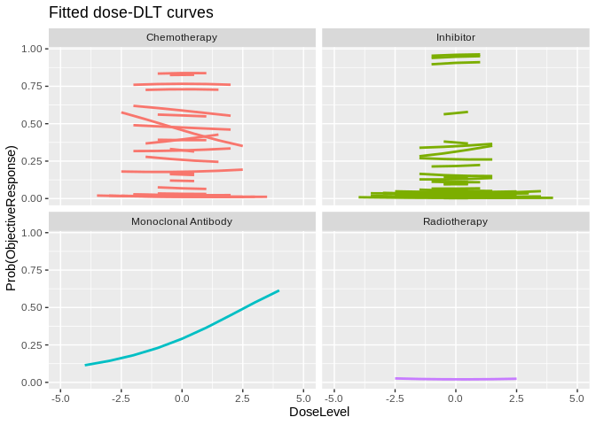
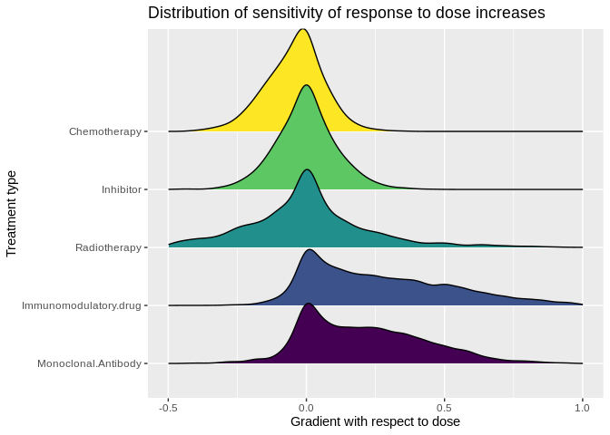

Analysis supporting ICTMC2019 submission
================
Kristian Brock
05 May, 2019

Load data:

``` r
library(glue)
library(ggplot2)
library(broom)
library(purrr)
library(broom)
library(tidyr)

library(brms)
library(tidybayes)
library(ggridges)

source('../../Load.R')
```

Dose finding trials investigate many doses of an experimental treatment
or combination.

# Fit separate GLMs to each series

Having collected data, we estimate the probabilitiy of DLT and objective
response on dose-level.

#### DLTs

Our outcome for analysing general toxicity in these trials is
dose-limiting toxicity, or *DLT*.

Our models will be very simple. Each takes an intercept term and a
gradient with respect to dose-level, using the logit link function.
Thus, average toxicity is estimated via the intercept term, and the
average sensitivity to dose increases is estimated via the gradient
term. No further complexity is considered given the general tiny sample
size of dose-finding trials.

``` r
dlt %>% 
  group_by(Study, AnalysisSeriesId) %>% 
  nest() %>% 
  mutate(
    num_dose = map_int(data, nrow),
    num_pat = map_dbl(data, .f = function(df) sum(df$n)),
    num_event = map_dbl(data, .f = function(df) sum(df$Events)),
    model = map(.f = function(df) {
      glm(ProbEvent ~ 1 + DoseLevel, data = df, weights = n,
          family = binomial('logit')) }, 
      .x = data),
    tidy_model = map(model, tidy),
    fitted = map(model, augment, type.predict = 'response'),
    # Column 2, row 2 of tidy model is estimated slope parameter for dose-level
    dose_grad = map(tidy_model, 2) %>% map_dbl(2) 
  ) -> dlt_models
```

Many of these models report numerical problems with probabilities of 0
or 1 being fit. Once again, the small average sample size is a problem.
For instance:

``` r
dlt_models$num_pat %>% summary()
```

    ##    Min. 1st Qu.  Median    Mean 3rd Qu.    Max. 
    ##    4.00   14.00   20.00   22.68   28.50   93.00

The median number of patients in a model is 20; the mean is 22.7.

``` r
dlt_models$num_event %>% summary()
```

    ##    Min. 1st Qu.  Median    Mean 3rd Qu.    Max. 
    ##   0.000   1.000   3.000   3.142   4.000  11.000

The median number of DLTs seen is 3.

Thus we are trying to model rare events with small sample sizes. The
*separate models* approach is very unlikely to provide a robust
analysis. A hierarchical bayesian analysis may improve inference
dramatically if the various weak insights from many models can be
combined in a sensible and robust way. We consider that below. For now,
we continue with the GLM analysis to see what the data reveal.

``` r
dlt_models$num_dose %>% summary()
```

    ##    Min. 1st Qu.  Median    Mean 3rd Qu.    Max. 
    ##   2.000   2.000   4.000   4.148   5.000  28.000

The average number of doses is 4.

#### Objective response

We use objective response (either by RECIST or any of the
disease-specific analogues like the Cheson criteria) to indicate
efficacy because these are the outcomes that are most commonly reported
in trials when efficacy is assessed.

Fitting the equivalent models that we fit before:

``` r
obj_resp %>% 
  group_by(Study, AnalysisSeriesId) %>% 
  nest() %>% 
  mutate(
    num_dose = map_int(data, nrow),
    num_pat = map_dbl(data, .f = function(df) sum(df$n)),
    num_event = map_dbl(data, .f = function(df) sum(df$Events)),
    model = map(.f = function(df) {
      glm(ProbEvent ~ 1 + DoseLevel, data = df, weights = n,
          family = binomial('logit')) }, 
      .x = data),
    tidy_model = map(model, tidy),
    fitted = map(model, augment, type.predict = 'response'),
    # Column 2, row 2 of tidy model is estimated slope parameter for dose-level
    dose_grad = map(tidy_model, 2) %>% map_dbl(2) 
  ) -> obj_resp_models
```

#### Inferences

The sign of the estimated sensitivities to `DoseLevel` provide
information on the tendency for binary toxicity and efficacy outcomes to
become more likely as dose is increased:

``` r
mean(dlt_models$dose_grad > 0)
```

    ## [1] 0.7806452

``` r
mean(obj_resp_models$dose_grad > 0)
```

    ## [1] 0.5053763

In 78% of the fitted DLT models, DLT incidence is seen to be positively
related to dose level. This is consistent with the adage *the dose makes
the poison*, i.e. higher doses are more likely to induce adverse events.
In constrast, half the models suggest a positive association between
dose and efficacy, implying that the other half suggest the opposite.

It may be illuminating to pair up the toxicity and efficacy signals
within trial. We may be interested in whether positive association with
dose is coincident in the two outcomes, and where the sensitivity tends
to be stronger.

There may be several dose-event gradient estimates for a study because
non-monotonically increasing doses tend to be used. E.g. 10mg per day is
not necessarily greater than or less than 50mg per week because the
delivered quantity has increased but the frequency has decreased.
Whether the combined effects increase or decrease toxicity risk will be
determined by how the body deals with the drug. An analagous problem is
commonly seen in dose-finding trials of two agents. Our pragmatic
solution is to analyse subsets of doses tha *are* unambiguously
orderable. This yields multiple estimates per study in some cases.
Collapse the estimates by simple averageing:

``` r
dlt_models %>% 
  group_by(Study) %>% 
  summarise(dlt_dose_grad = mean(dose_grad)) %>% 
  inner_join(
    obj_resp_models %>% 
      group_by(Study) %>% 
      summarise(obj_resp_dose_grad = mean(dose_grad)),
    by = 'Study'
  ) -> paired_dose_sensitivities
```

We only have data here when a trial reports both DLT and objective
response. We may answer the question, how commonly is the
dose-sensitivity stronger in DLT than response?

``` r
paired_dose_sensitivities %>% 
  summarise(mean(dlt_dose_grad > obj_resp_dose_grad))
```

    ## # A tibble: 1 x 1
    ##   `mean(dlt_dose_grad > obj_resp_dose_grad)`
    ##                                        <dbl>
    ## 1                                      0.716

Further evidence that toxicity is more sensitive to dose increases. Let
us visualise the fitted parameters.

``` r
paired_dose_sensitivities %>% 
  ggplot(aes(x = dlt_dose_grad, y = obj_resp_dose_grad)) + 
  geom_point() + 
  geom_abline(col = 'red', linetype = 'dashed') + 
  labs(x = 'Sensitivity of DLT to dose',
       y = 'Sensitivity of objective response to dose')
```

<!-- -->

We see that some implausible sensitivities are fit, with absolute values
commonly exceeding 10. However, there is general evidence that
sensitivities are greater for DLT - most points lay below the 45-degree
line.

We could zoom in on the absolute values fit between \[0, 2\]. Perhaps we
are more confident in these values:

``` r
paired_dose_sensitivities %>% 
  left_join(studies, by = 'Study') %>% 
  filter(abs(dlt_dose_grad) <= 2 & abs(obj_resp_dose_grad) <= 2) %>% 
  ggplot(aes(x = dlt_dose_grad, y = obj_resp_dose_grad)) + 
  geom_point(aes(col = DoseVaryingTreatmentType)) + 
  geom_abline(col = 'red', linetype = 'dashed') + 
  labs(x = 'Sensitivity of DLT to dose increases',
       y = 'Sensitivity of objective response to dose increases')
```

<!-- -->

Once again, the trend is for values to lay below the \(y=x\) line,
suggesting that DLT is more sensitive than efficacy to increases in
dose.

The implication of this message is that when we escalate dose in
dose-finding trials, we are likely embracing higher chances of toxicity
faster than we are achieving increases in the probability of response.

These inferences are tempered somewhat by the small individual sample
sizes and the computational problems. We consider an alternative
analysis by Bayesian hierarchical models.

# Bayesian hierarchical models

Bayesian hierarchical models have the attraction of partially pooling
estimates of intercepts and gradients by assuming exchangeability within
a distribution of group-level effects. We fit models for DLT and
response outcomes that assume:

  - each series takes its own intercept and dose sensitivity;
  - each treatment type also confers its own intercept and dose
    sensitivity;
  - effects are additive.

Thus, this model form allows us to estimate the extent to which
dose-event sensitivity is positive for each drug type.

Fitting the models using `brms`:

``` r
library(brms)

dlt_mod <- brm(Events | trials(n) ~ (1 + DoseLevel | AnalysisSeriesId) + 
                 (1 + DoseLevel | DoseVaryingTreatmentType), 
               data = dlt %>% left_join(studies, by = 'Study'), 
               family = binomial('logit'), 
               control = list(adapt_delta = 0.95), cores = 4, seed = 123,
               file = 'dlt_mod')

obj_resp_mod <- brm(Events | trials(n) ~ (1 + DoseLevel | AnalysisSeriesId) + 
                      (1 + DoseLevel | DoseVaryingTreatmentType), 
                    data = obj_resp %>% 
                      left_join(studies, by = 'Study') %>% 
                      filter(n > 0), 
                    family = binomial('logit'), 
                    control = list(adapt_delta = 0.99), cores = 4, seed = 123,
                    file = 'obj_resp_mod')
```

``` r
summary(dlt_mod)
```

    ##  Family: binomial 
    ##   Links: mu = logit 
    ## Formula: Events | trials(n) ~ (1 + DoseLevel | AnalysisSeriesId) + (1 + DoseLevel | DoseVaryingTreatmentType) 
    ##    Data: dlt %>% left_join(studies, by = "Study") (Number of observations: 643) 
    ## Samples: 4 chains, each with iter = 2000; warmup = 1000; thin = 1;
    ##          total post-warmup samples = 4000
    ## 
    ## Group-Level Effects: 
    ## ~AnalysisSeriesId (Number of levels: 150) 
    ##                          Estimate Est.Error l-95% CI u-95% CI Eff.Sample
    ## sd(Intercept)                0.91      0.12     0.70     1.15       1573
    ## sd(DoseLevel)                0.49      0.09     0.32     0.69       1077
    ## cor(Intercept,DoseLevel)     0.12      0.19    -0.25     0.49       1448
    ##                          Rhat
    ## sd(Intercept)            1.00
    ## sd(DoseLevel)            1.00
    ## cor(Intercept,DoseLevel) 1.00
    ## 
    ## ~DoseVaryingTreatmentType (Number of levels: 16) 
    ##                          Estimate Est.Error l-95% CI u-95% CI Eff.Sample
    ## sd(Intercept)                0.55      0.33     0.04     1.32        849
    ## sd(DoseLevel)                0.87      0.28     0.46     1.55       1303
    ## cor(Intercept,DoseLevel)     0.09      0.57    -0.88     0.97        230
    ##                          Rhat
    ## sd(Intercept)            1.00
    ## sd(DoseLevel)            1.00
    ## cor(Intercept,DoseLevel) 1.02
    ## 
    ## Population-Level Effects: 
    ##           Estimate Est.Error l-95% CI u-95% CI Eff.Sample Rhat
    ## Intercept    -2.49      0.34    -3.22    -1.89        365 1.01
    ## 
    ## Samples were drawn using sampling(NUTS). For each parameter, Eff.Sample 
    ## is a crude measure of effective sample size, and Rhat is the potential 
    ## scale reduction factor on split chains (at convergence, Rhat = 1).

``` r
summary(obj_resp_mod)
```

    ##  Family: binomial 
    ##   Links: mu = logit 
    ## Formula: Events | trials(n) ~ (1 + DoseLevel | AnalysisSeriesId) + (1 + DoseLevel | DoseVaryingTreatmentType) 
    ##    Data: obj_resp %>% left_join(studies, by = "Study") %>%  (Number of observations: 372) 
    ## Samples: 4 chains, each with iter = 2000; warmup = 1000; thin = 1;
    ##          total post-warmup samples = 4000
    ## 
    ## Group-Level Effects: 
    ## ~AnalysisSeriesId (Number of levels: 93) 
    ##                          Estimate Est.Error l-95% CI u-95% CI Eff.Sample
    ## sd(Intercept)                2.57      0.31     2.05     3.27       1176
    ## sd(DoseLevel)                0.19      0.11     0.01     0.43       1034
    ## cor(Intercept,DoseLevel)     0.15      0.48    -0.84     0.93       2444
    ##                          Rhat
    ## sd(Intercept)            1.00
    ## sd(DoseLevel)            1.00
    ## cor(Intercept,DoseLevel) 1.00
    ## 
    ## ~DoseVaryingTreatmentType (Number of levels: 12) 
    ##                          Estimate Est.Error l-95% CI u-95% CI Eff.Sample
    ## sd(Intercept)                1.35      0.89     0.14     3.61        619
    ## sd(DoseLevel)                0.26      0.19     0.01     0.73       1307
    ## cor(Intercept,DoseLevel)     0.14      0.57    -0.93     0.96       1100
    ##                          Rhat
    ## sd(Intercept)            1.01
    ## sd(DoseLevel)            1.00
    ## cor(Intercept,DoseLevel) 1.00
    ## 
    ## Population-Level Effects: 
    ##           Estimate Est.Error l-95% CI u-95% CI Eff.Sample Rhat
    ## Intercept    -2.69      0.65    -4.17    -1.57       1269 1.00
    ## 
    ## Samples were drawn using sampling(NUTS). For each parameter, Eff.Sample 
    ## is a crude measure of effective sample size, and Rhat is the potential 
    ## scale reduction factor on split chains (at convergence, Rhat = 1).

The models fit with no warnings of divergences or violations of maximum
tree-depth. The effective sample sizes look reasonable.

We use `tidybayes` to add posterior fitted draws and infer the implied
dose-DLT curve from each series.

``` r
dlt %>% 
  left_join(studies, by = 'Study') %>% 
  filter(DoseVaryingTreatmentType %in% c('Chemotherapy', 
                                         'Radiotherapy', 
                                         'Monoclonal Antibody', 
                                         'Inhibitor')) %>% 
  add_fitted_draws(dlt_mod) %>%
  mutate(EstProbEvent = .value / n) %>% 
  summarise(EstProbEvent = mean(EstProbEvent)) %>% 
  ggplot(aes(x = DoseLevel, y = EstProbEvent, group = AnalysisSeriesId, 
             col = DoseVaryingTreatmentType)) + 
  geom_line(size = 1) + 
  facet_wrap(~ DoseVaryingTreatmentType, ncol = 2) + 
  xlim(-5, 5) +
  labs(title = 'Fitted dose-DLT curves', col = 'Drug type', y = 'Prob(DLT)') + 
  theme(legend.position = 'none')
```

<!-- -->

There are other treatment types but we visualise just these four for
clarity. Certainly these are the staples of modern oncology treatment.
We see that dose senstivity could safely be taken to be positive under
chemo, inhibitors, and radiotherapy. The relationship is rather less
prounounced for mononclonal antibodies. This is confirmed by visualising
the posterior distribution of the dose-sensitivitites that the model
attributes to treatment type, i.e. distinct from effects attributable to
individual heterogeneity in series.

``` r
dlt_mod %>% 
  spread_draws(r_DoseVaryingTreatmentType[TmtType,term]) %>%
  filter(TmtType %in% c('Radiotherapy', 'Monoclonal.Antibody', 'Chemotherapy', 
                        'Inhibitor', 'Immunomodulatory.drug')) %>% 
  mutate(TmtTypeO = factor(TmtType, levels = c('Monoclonal.Antibody',
                                               'Immunomodulatory.drug',
                                               'Radiotherapy',
                                               'Inhibitor',
                                               'Chemotherapy'), 
                           ordered = TRUE)) %>%
  filter(term == 'DoseLevel') %>% 
  ggplot(aes(y = TmtTypeO, group = TmtTypeO, fill = TmtTypeO, 
             x = r_DoseVaryingTreatmentType)) + 
  geom_density_ridges() + 
  labs(x = 'Gradient with respect to dose', y = 'Treatment type',
       title = 'Distribution of sensitivity of DLT to dose increases') +
  theme(legend.position = 'none') + 
  xlim(-1.5, 2.5)
```

<!-- --> This plot
creates a nice cascade. We might not be surprised that chemo
demonstrates the strongest evidence that higher doses are more likely to
yield DLT, given that chemo treatments are cytotoxic. Notably, inhibitor
drugs, also commonly called molecularly targeted agents, exhibit strong
evidence of DLT risk increasing in dose. That relationship is much less
pronounced for the relatively low numer of antibody drugs in this
dataset.

We create the same visualisation for the objective response data.

``` r
obj_resp %>% 
  filter(n > 0) %>% 
  left_join(studies, by = 'Study') %>% 
  filter(DoseVaryingTreatmentType %in% c('Chemotherapy', 
                                         'Radiotherapy', 
                                         'Monoclonal Antibody', 
                                         'Inhibitor')) %>% 
  add_fitted_draws(obj_resp_mod) %>%
  mutate(EstProbEvent = .value / n) %>% 
  summarise(EstProbEvent = mean(EstProbEvent)) %>% 
  ggplot(aes(x = DoseLevel, y = EstProbEvent, group = AnalysisSeriesId, 
             col = DoseVaryingTreatmentType)) + 
  geom_line(size = 1) + 
  facet_wrap(~ DoseVaryingTreatmentType, ncol = 2) + 
  xlim(-5, 5) +
  labs(title = 'Fitted dose-DLT curves', col = 'Drug type', 
       y = 'Prob(ObjectiveResponse)') + 
  theme(legend.position = 'none')
```

<!-- -->

Here the relationships with dose are much less pronounced. The
distributions of the treatment-specific dose effects all straddle zero:

``` r
obj_resp_mod %>% 
  spread_draws(r_DoseVaryingTreatmentType[TmtType,term]) %>%
  filter(TmtType %in% c('Radiotherapy', 'Monoclonal.Antibody', 'Chemotherapy', 
                        'Inhibitor', 'Immunomodulatory.drug')) %>% 
  mutate(TmtTypeO = factor(TmtType, levels = c('Monoclonal.Antibody',
                                               'Immunomodulatory.drug',
                                               'Radiotherapy',
                                               'Inhibitor',
                                               'Chemotherapy'), 
                           ordered = TRUE)) %>%
  filter(term == 'DoseLevel') %>% 
  ggplot(aes(y = TmtTypeO, group = TmtTypeO, fill = TmtTypeO, 
             x = r_DoseVaryingTreatmentType)) + 
  geom_density_ridges() + 
  labs(x = 'Gradient with respect to dose', y = 'Treatment type',
       title = 'Distribution of sensitivity of response to dose increases') +
  theme(legend.position = 'none') + 
  xlim(-0.5, 1)
```

<!-- -->

The Bayesian hierarchical analysis has echoed the inferences from the
series-specific models presented above, and provided some additional
insights attributable to individual treatments.

There is strong evidence that the risks of DLT increase in dose in many
treatments like chemo, inhibitors, and radiotherapy. The relationship is
rather weaker for monoclonal antibodies. There is much less evidence to
support the assumption that the chances of objective response are
increased on average by increasing dose.

Thus in dose-finding trials, the data suggest that escalations have
tended to coerce greater toxicity risk without commensurate increases in
the chances of response. Dose-effects for response cannot be ruled out
based on this analysis. However, the uncertainty surrounding their
presence suggests that trialists should avoid relying unduly on
establishing a maximum tolerable dose and instead focus on identifying
the dose that offers the most attractive trade-off between the competing
outcomes of DLT and response. Use of so-called seamless phase I/II
designs like EffTox (Thall & Cook, 2004), Wages & Tait (2015), TriCRM
(Zhang et al, 20??) and BiCRM (Braun, 20??) could help achieve this
goal.
